# MINUMUM DEBIAN LINUX INSTALL

Step by step instructions for minimum Debian Linux installation.
 
## 1. Objectives.

The aim of this guide is to show how to install Debian Linux 12 bookworm. It is not an in-depth discussion/guide about installation options, because this is beyond the scope of this short guide. The main goal is to provide standardized documented Debian Linux installation for all installation scripts based on this guide.

## 2. Resources used in this guide.

To successfully finish this guide, we need a physical device or virtual machine with at least the following specifications:
- CPU: 1 core,
- RAM: 1 GiB,
- STORAGE: 20GB,
- LAN: one network card.
- Network infrastructure: static network or IPv4 DHCP server.
- Access to Debian Linux repositories (internet connectivity).
- Install image: depending on architecture image from

```https://www.debian.org/CD/netinst/```
 
Remarks:
- Installation may succeed even with fewer resources than shown here.
- In practical use cases (installation scripts based on this Debian Linux installation guide), they may normally require more resources.
- This guide is based on the Debian 12.9 Bookworm Linux install image from:
	
    ```https://cdimage.debian.org/debian-cd/current/amd64/iso-cd/debian-12.9.0-amd64-netinst.iso```
	
- For our install guide we will use amd64 image in a virtual machine.
- Other architectures than "amd64" work equally well with this guide.
- Future releases may have some incompatibilities and/or breaking changes.
- We will try to cover future versions of Debian Linux as much as possible based on our limited resources.
	

## 3. Before you begin.

Please prepare the following information to start installation (our values in brackets):
- hostname: your host name for this installation: ("**mi**", as a minimal install).
- domain name: your domain name for installation: ("**xsevers.local**")
- IPv4 address: DHCP / static provisioning as fits: (**DHCP**)
	- with the following parameters:
	- network: **172.31.20.0/24**
	- net mask: **255.255.255.0**
	- gateway: **172.31.20.1**
	- DNS server: **172.31.20.1**
- Prepare your physical/virtual platform with correct parameters for installation.

We will use a simple partitioning scheme of our single volume for file systems:
- root: 20.4 GB
- swap: 1 GB

In real use scenarios we would require it to have more complex partitioning, but for our template, this is sufficient.

## 4. Installation procedure.

### 4.1. Mount media and start a virtual / physical machine.

The first step is to mount the downloaded net install image to the virtual CD-ROM, or write the net install image to the installation media. For our demo case we will use a virtual machine and mount the net install image to a virtual CD-ROM.

### 4.2. GRUB menu.

The installation process will wait 30 seconds on the GRUB menu after the virtual machine has been powered on and booted from install media. The method of installation must be chosen. The term "Graphical install" will be used in this article; however, "Install" is rather comparable in text mode.

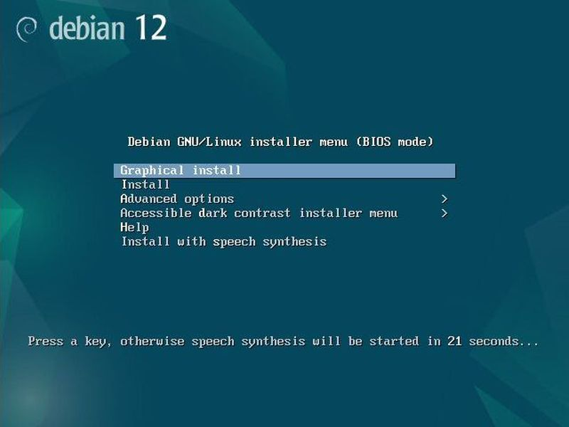
<center>Image 1: GRUB menu.</center>

### 4.3. Select a language.

From the menu, select the language to be used during the install procedure, and it will be installed as the default language in Debian Linux.

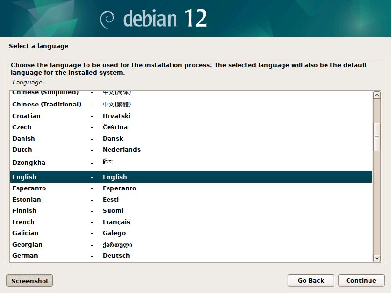
<center>Image 2: Select a language.</center>

### 4.4. Select your location.

It is important to select a real location. Some configuration choices depend on this decision (for example, which mirror to use during install). Our location is Slovenia. We will use "other" as a location...

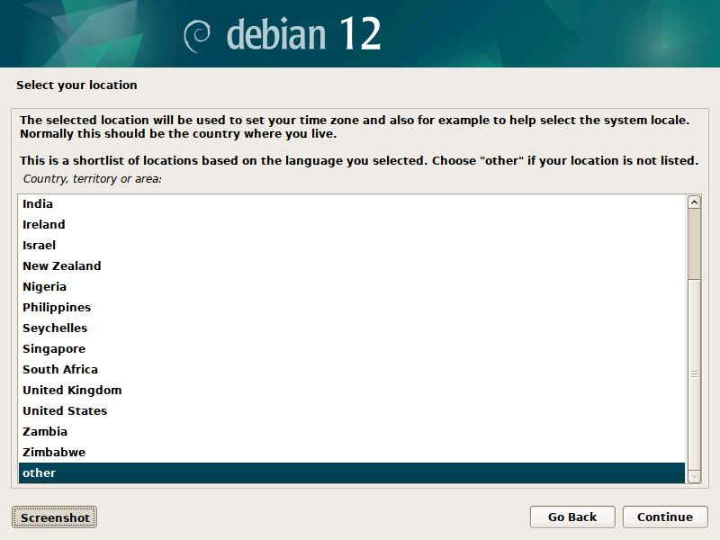
<center>Image 3: Select your location.</center>

### 4.5. Select Continent.

... and use "Europe" as our continent ...

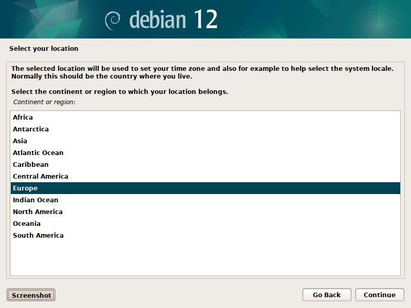
<center>Image 4: Select Continent.</center>

### 4.6. Select Country.

... and select "Slovenia" as the country. Of course your selection for location may be different than in our example.

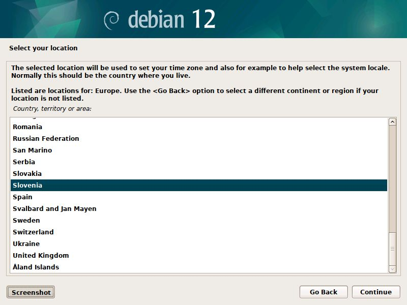
 <center>Image 5: Select Country.</center>

### 4.7. Configure Locales.

Debian Linux should have information on which locales should be used as defaults. Select the preferred one here.

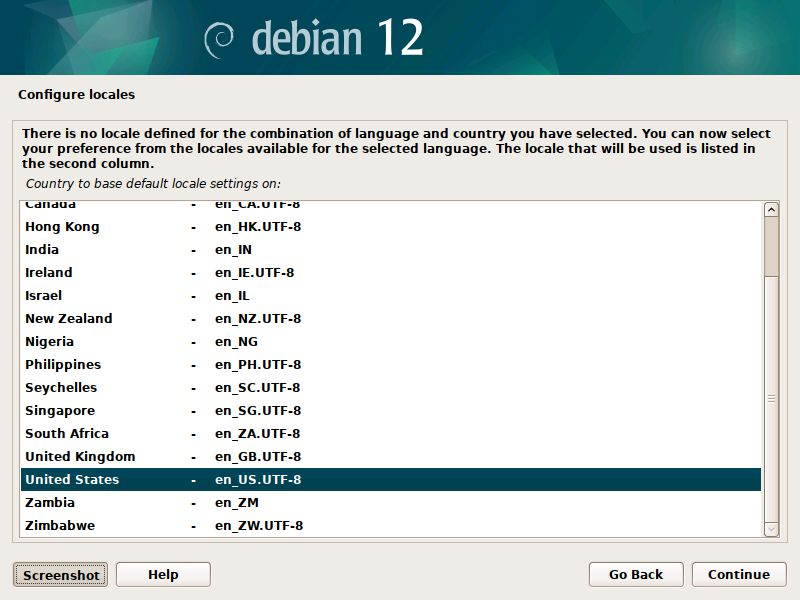
<center>Image 6: Configure Locales.</center>

### 4.8. Configure the Keyboard.

Select preferred keyboard mapping for your physical/virtual keyboard.

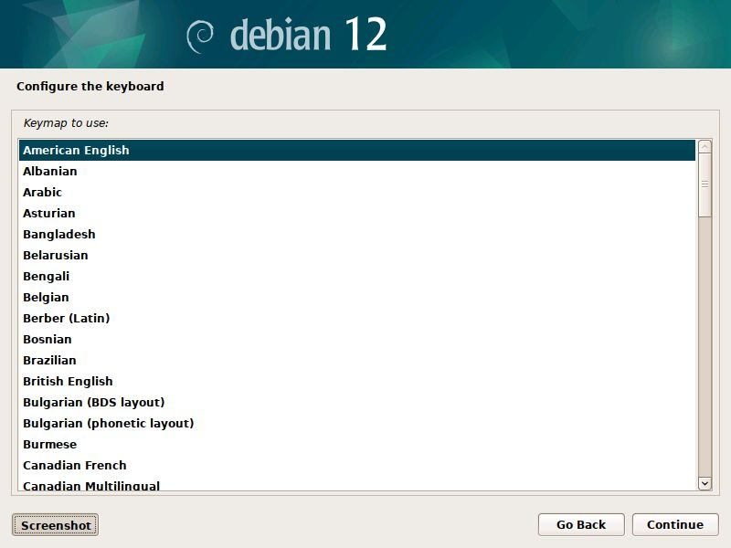
<center>Image 7: Configure the Keyboard.</center>

### 4.9. Loading additional Components.

After gathering some basic information, the installer will load its own install modules. It may take some time, normally about 20 seconds..

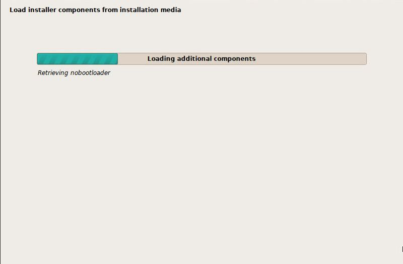
<center>Image 8: Loading additional Components.</center>

### 4.10. IPv6 Network Provisioning.

Installation will immediately proceed to the IPv6 provisioning / configuration...

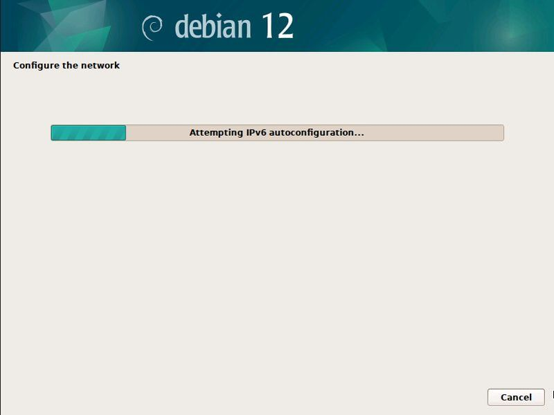
<center>Image 9: IPv6 Network Provisioning.</center>

[ MARKER ]: #

### 4.11. IPv4 Network Provisioning.

... and then automatically proceed to the IPv4 provisioning /configuration. Each steps may take several each. We will use DHCP for IPv4 as our start choice. Latter on other script(s) (not released yet) may modify configuration.

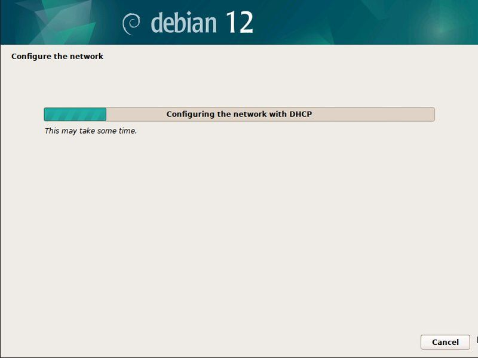
<center>Image 10: IPv4 Network Provisioning.</center>

### 4.12. Configure Host Name.

We will use short host name "mi" (minimal install) for this install.

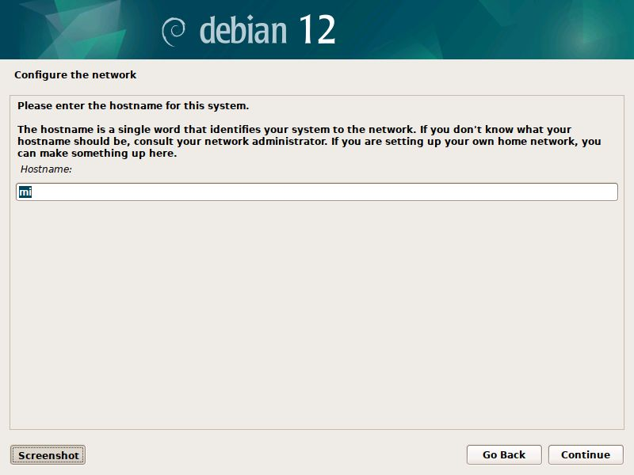
<center>Image 11: Configure Host Name.</center>

### 4.13. Configure Domain Name.

We will use domain name "xservers.local" to denote locality of our installation. This domain is not arbitrary. Any suitable domain may be used, of course preferably one which you have control on.

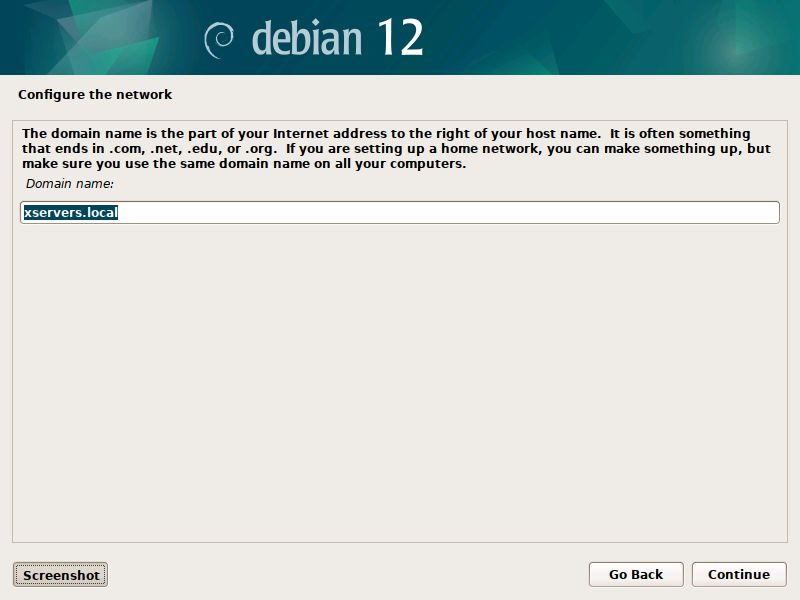
<center>Image 12: Configure Domain Name.</center>

### 4.14. Set root Password.

It is important to select strong root (main administrative account) password. By default user root can not login direct over ssh, but it is sill important to have strong password as username on Linux is always same. I can not emphasize how important it is that password for different Linux machines and users are unique.

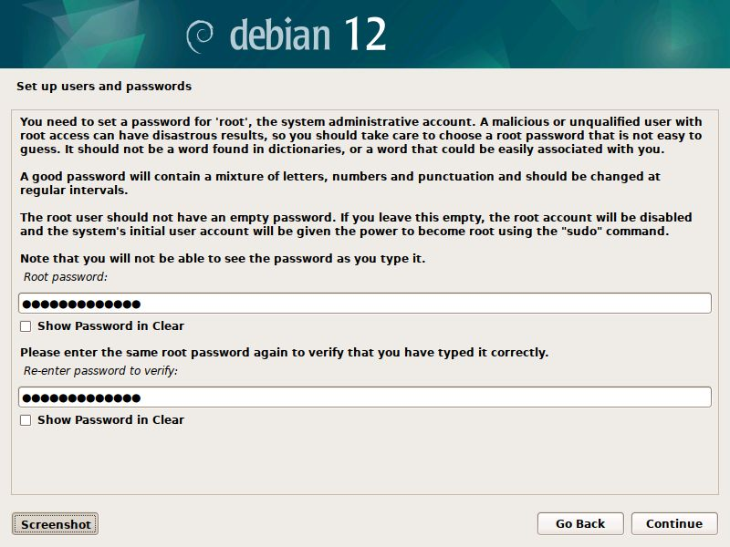
<center>Image 13: Set root Password.</center>

### 4.15. Add User.

In this step we will configure at least one regular user and their account. This will latter on enable us to login remote with ssh protocol. We will use "localadmin" as our selection for name of new user.

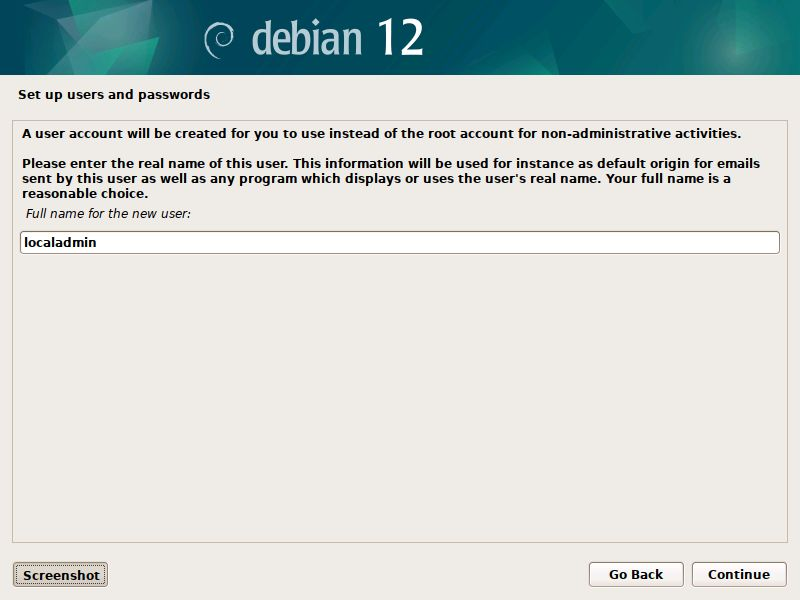
<center>Image 14: Add User.</center>

### 4.16. Add User Account.

In previous step we configure "human user name", here we will define name for Linux account for user on this machine.

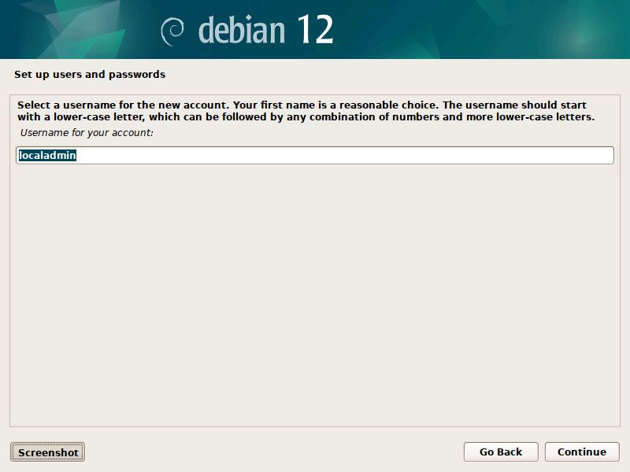
<center>Image 15: Add User Account.</center>

### 4.17. Set User Password.

It is important to select strong password for our defined user as we will use it for ssh login. By default user "localadmin" can login direct over ssh with password only. I can not emphasize how important it is that password for different Linux machines and users are unique.

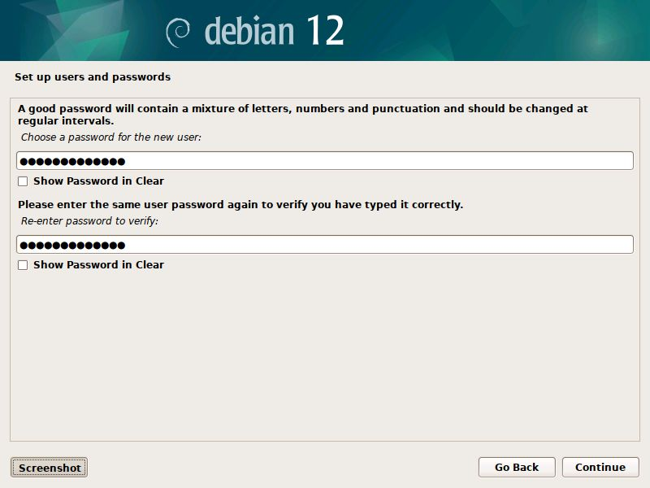
<center>Image 16: Set User Password.</center>

### 4.18. Load Additional Components.

Installation process will load various modules necessary for installation of storage based on hardware of our virtual machine. Since our storage configuration is simple this process finishes in about 5 seconds.

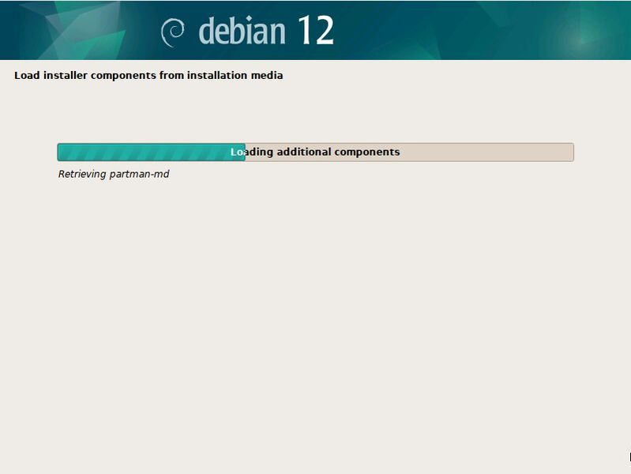
<center>Image 17: Load Additional Components.</center>

### 4.19. Select Partitioning Method.

This installer has some predefined procedures for disk partitioning. We will select simplest one. This one is sufficient for our scope. Even for more complex situations many times we use simple installation method like this and then add necessary additional storage / file systems with scripts and / or automation tools (ansible).

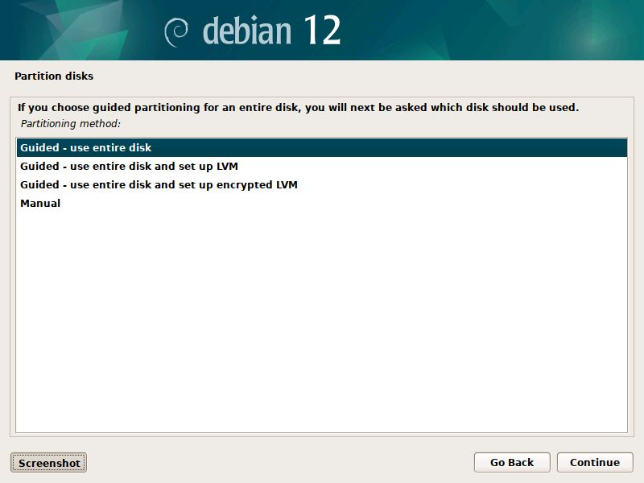
<center>Image 18: Select Partitioning Method.</center>

### 4.20. Select Disk.
For our purposes we have only one disk, so let select it and install all files on it.

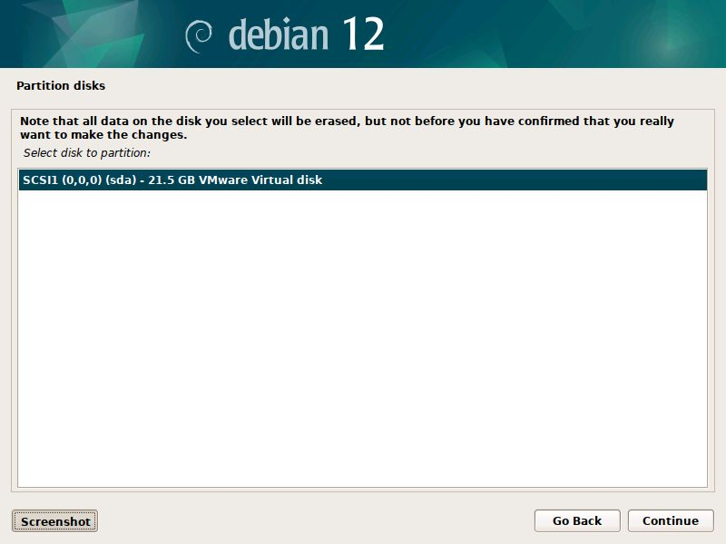
<center>Image 19: Select Disk.</center>

### 4.21. Select Partitioning Scheme.

Since we choose simple installation method we will also chose simple partition scheme with two partitions. One filesystem named root for all files and other for swap space (paging partition).

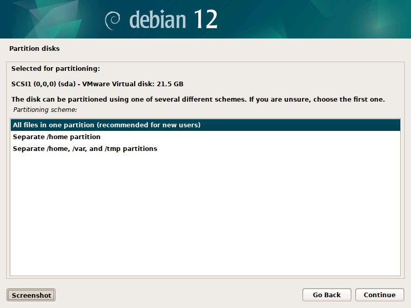
<center>Image 20: Select Partitioning Scheme.</center>

### 4.22. Confirm Partition Scheme.

In this step we confirm disk re-partitioning.

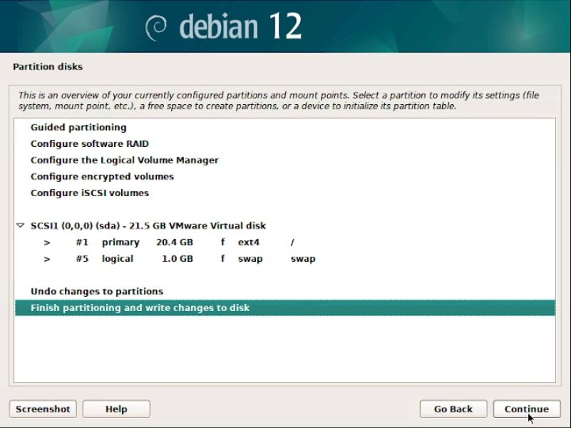
<center>Image 21: Confirm Partition Scheme.</center>


### 4.23. Confirm Partition write.

Until this step no data have been written to disk (storage media) with this action partition table will be updated and any previous data on disk (storage device) will be lost.

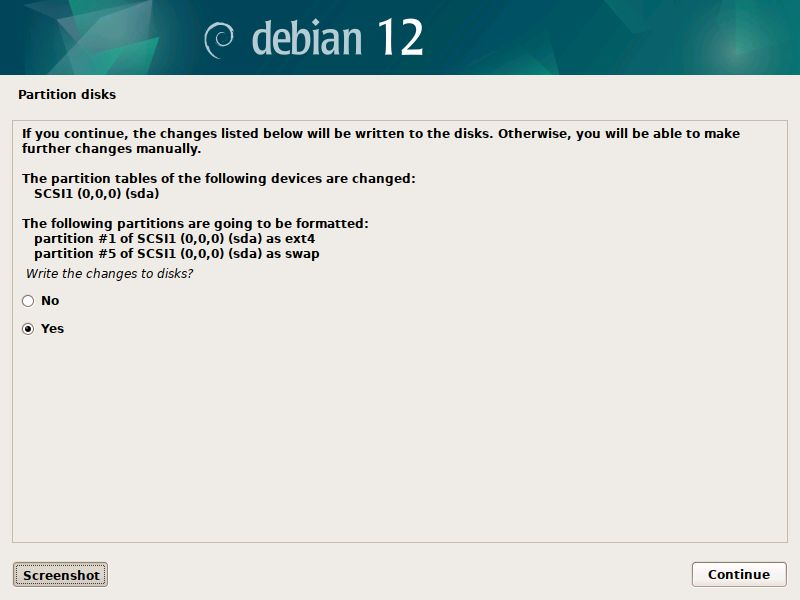
<center>Image 22: Confirm Partition write.</center>

### 4.24. Installing the Base System.

Installer creates partition tables and creates file systems. Then install base packages to root file system.

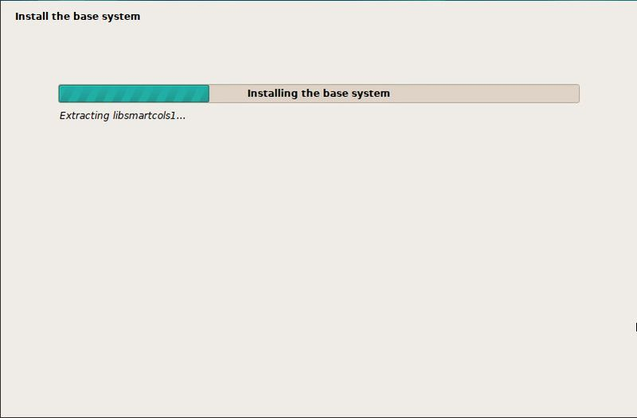
<center>Image 23: Installing the Base System.</center>

### 4.25. Scan Extra Install Media.

This step provides possibility to install additional device drivers (kernel modules) for any additional hardware. We do not have any non standard device (at least this is assumption for this install) and we can safely say no to this question and confirm it.

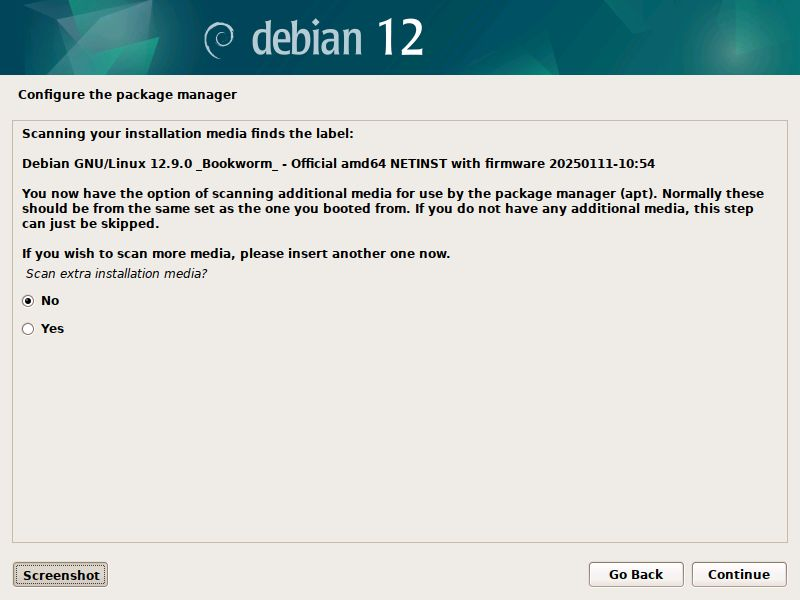
<center>Image 24: Scan Extra Install Media.</center>

### 4.26. Select Country for Debian Linux Mirror.

To decrease usage of internet links and speed up install process installer will collect country from which we are running this installer right now.

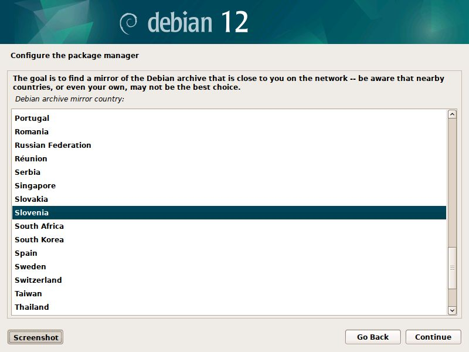
<center>Image 25: Select Country for Debian Linux Mirror.</center>

### 4.27. Get Proxy Information.

We will not use proxy as we are assuming non proxy network. Leave this field blank, just confirm and proceed to next step.

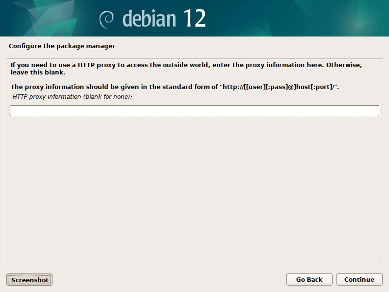
<center>Image 26: Get Proxy Information.</center>

### 4.28. Set Debian Archive Mirror.

Based on all gathered information installer will suggest some mirror(s) to use for this installation.

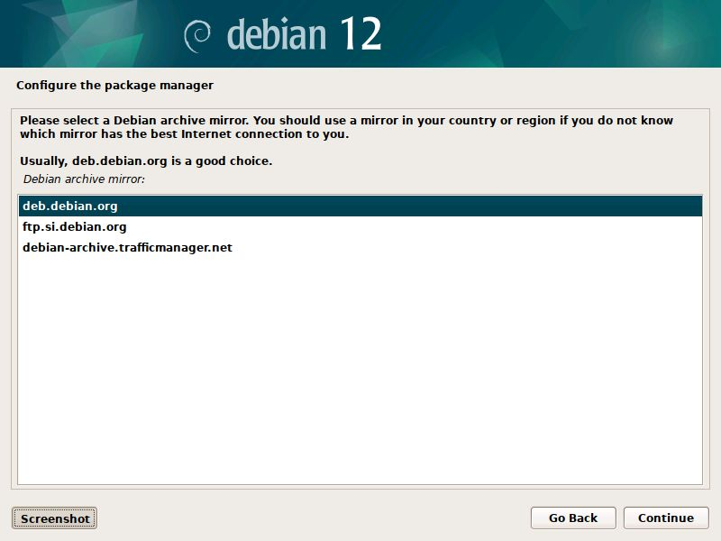
<center>Image 27: Set Debian Archive Mirror</center>

### 4.29. Select and Install Software.

Installer can handle more complex installation procedures. Normally absolute minimum is installed during installation process. We have far better control over packages installation from ssh command line, once minimum Debian Linux is installed.

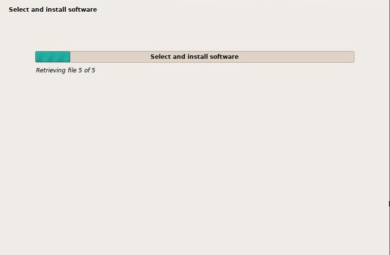
<center>Image 28: Select and Install Software.</center>

### 4.30. Configure Popularity Contest.

Popularity contest collects statistical data about packages installation/usage, Normally this component of Debian Linux is not necessary, but you may select it if you wish to stream statistical data to Debian maintainers.

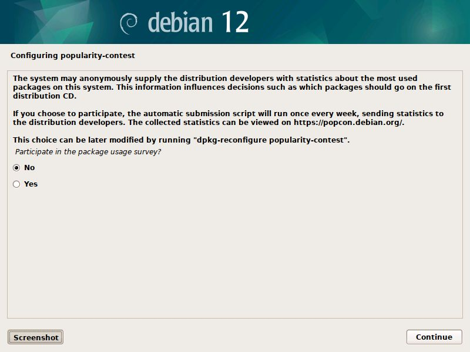
<center>Image 28: Configure Popularity Contest.</center>

### 4.31. Choose Software to Install.

We will deploy minimal Debian Linux. All packages except "SSH server" and "Standard system utilities" should be deselected. In this way we maintain minimal Debian Linux "footprint". If we will need any additional package(s) we can simply install it latter.

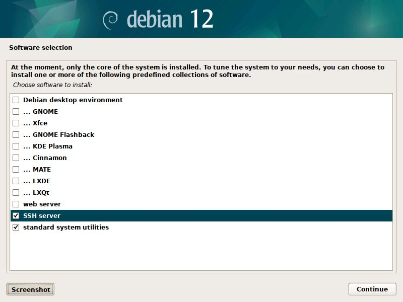
<center>Image 30: Choose Software to Install.</center>

### 4.32. Install boot loader.

We need to install "boot loader" to bootstrap our Debian Linux from disk (storage device). For this simple usage case select "Yes".

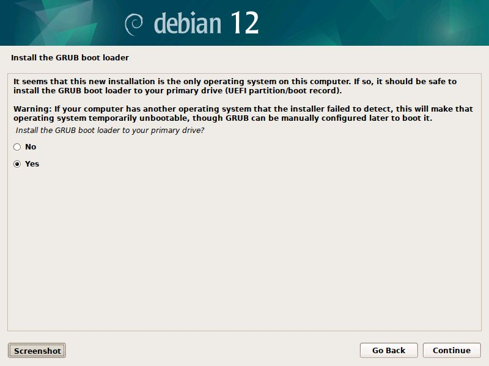
<center>Image 31: Install boot loader.</center>

### 4.33. Select device for Boot Loader.

Since we have only one disk (storage device) use automatic selection which is displayed in second line. In our case this is "/dev/sda":
- use SAS device driver (name "sd"),
- first storage device recognized by "sa" device driver (letter "a").

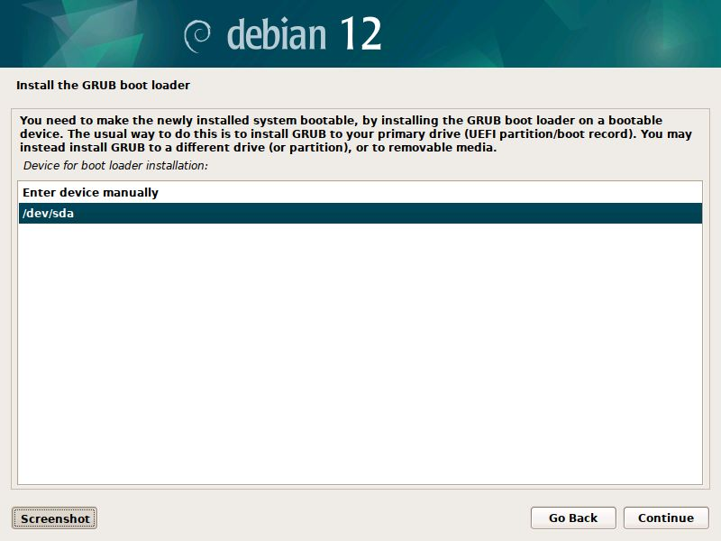
<center>Image 32: Select device for Boot Loader.</center>

### 4.34. Finishing the Installation.

Installer will perform some additional task and finish installation procedure.

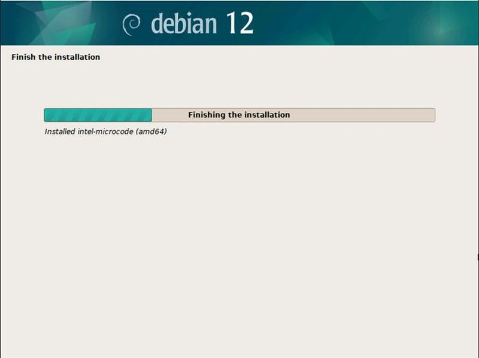
<center>Image 33: Finishing the Installation.</center>

### 4.35. Reboot.

Once all tasks are completed this scheen will inform us that we may proceed with "Continue" to reboot our physical / virtual machine.
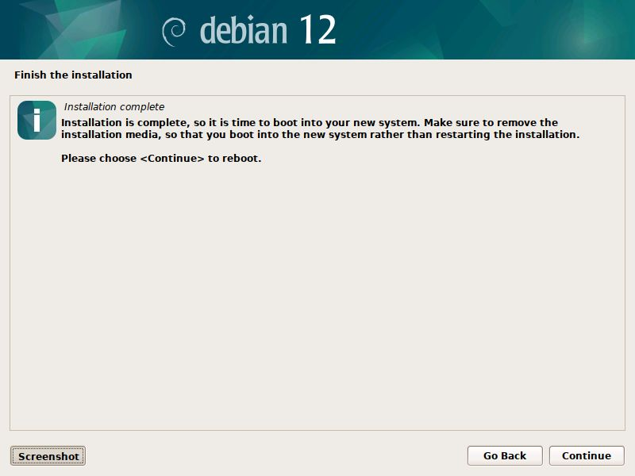
<center>Image 34: Reboot.</center>

## 5. Next step(s).

We successfully installed our Debian Linux operating system. 

### 5.1. Post install steps.

Normally I recommend to switch off virtual machine as soon as reboot procedure from step "4.35 Reboot" finishes. Best if this is performed during virtual machine POST. This preserves original state after installation. I also recommend to duplicate / copy resulting virtual machine as golden image for subsequent usage.

## 6. Conclusion.

Of course this simple installation guide is not recommended for any production use. I hope that in one of following guides we will explore in details all options necessary to have robust production recipe for Debian Linux install.

This reference installation will serve as baseline for any future installations of additional package(s) / future scripts.

---
\- end -
